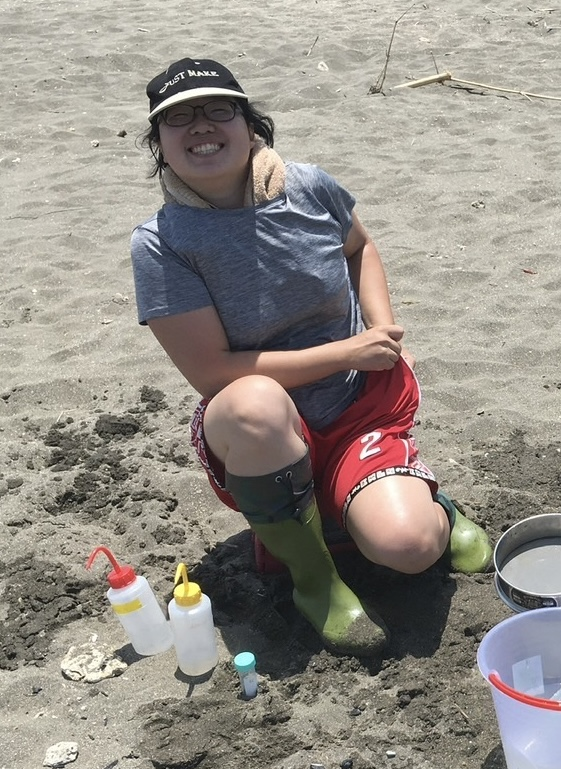

# YiChien Lee 

 

I am a Postdoctoral Fellow at the Biodiversity Research Center, Academia Sinica, Taiwan. As a biologist interested in evolutionary processes, my research is on understanding the complex mechanisms of species adaptation and evolution. Through my research, I seek to understand better how organisms have evolved and how these processes contribute to biodiversity. By focusing on the evolution of traits such as adaptation or parasitic relationships, I hope to shed light on the broader patterns of evolution and the forces that shape the natural world.
 
My expertise lies in utilizing cutting-edge sequencing technologies and bioinformatics approaches to assemble, annotate, and analyze the genomes and genes of various organisms. By combining these tools, I aim to explore the genetic change that drives evolution. A key component of my work is employing a comparative genomics strategy, which allows me to examine the similarities and differences across species, ultimately providing insights into their evolutionary history.
